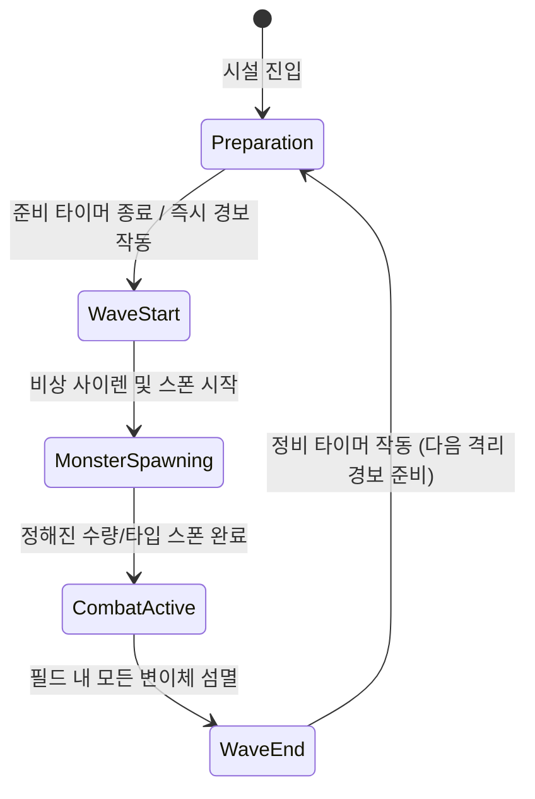
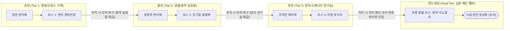

# 게임플레이 루프 및 핵심 메커니즘 (Gameplay Loop & Mechanics)

본 문서는 프로젝트의 **게임 목표, 핵심 게임플레이 루프, 웨이브 시스템, 보스 및 성장 프로그레션, 월드/시설 생성 메커니즘**을 정의한 기획 및 설계 문서입니다.

---

## 1. 게임 목표 (Game Objective)

- **핵심 목표: 중앙 "초자연 격리 코어(Containment Core)"의 결사 수호**
  - 플레이어 팀(1~4인 협동 연구원/엔지니어)은 지하 격리시설 중앙 챔버에 위치한 **격리 코어(Core)**를 폭주 및 파괴하려는 변이체들의 공격으로부터 지켜내야 합니다.
  - 코어의 내구도(격리 필드)가 0이 되면 격리 붕괴(대폭발)로 게임 오버(패배)됩니다.
- **클리어 조건:**
  - 주기적인 웨이브를 막아내며 탈출하는 **3마리의 특급 격리 개체(중간 보스)**를 차례로 제압하고, 최종적으로 출현하는 **최종 탈출 괴수(Final Boss)**를 격파하여 연구소를 완전 정상화/정화하면 최종 승리(게임 클리어)하게 됩니다.
- **게임 오버 및 리스폰 룰:**
  - 코어 체력(기본 1000)이 0이 되어 파괴될 경우, 생존한 플레이어 수와 무관하게 **즉시 게임 오버**됩니다.
  - 플레이어가 전멸하더라도 코어가 살아있다면 게임 오버되지 않습니다. 사망한 플레이어는 **일정 시간(예: 15초) 대기 후 안전 구역(초기 스폰 지점)에서 리스폰**되어 다시 방어에 참여할 수 있습니다.
  - 파손된 코어 체력은 자동 회복되지 않으며, 플레이어가 직접 수리 도구와 자원을 소모하여 고쳐야 합니다.

---

## 2. 핵심 게임플레이 루프 (Core Gameplay Loop)

게임은 **[스폰/탐색] ➔ [자원 해체/파밍] ➔ [장비 개조/방어선 구축] ➔ [격리 경보/웨이브 전투] ➔ [구역 셧다운 정비]**의 순환 구조를 가집니다.

```mermaid
flowchart TD
    Start([게임 시작 / 시설 스폰]) --> PrepPhase[1. 정비 및 시설 수색 단계]
    
    subgraph Loop["기본 게임플레이 루프"]
        PrepPhase --> Farming["자원 해체 & 파밍\n(오피스 가구, 서버 랙, 고철, 배터리 등)"]
        Farming --> Crafting["DIY 제작 & 방어선 구축\n(개조 무기, 도구 제작 및 바리케이드/터렛 설치)"]
        Crafting --> WaveStart[2. 격리 실패 경보 / 비상 사이렌]
        WaveStart --> Combat["3. 웨이브 전투\n(코어로 쇄도하는 변이체 요격 & 결사 방어)"]
        Combat --> WaveClear{웨이브 격퇴 성공?}
        WaveClear -- 성공 --> WaveEnd[4. 격리 안정화 및 재정비]
        WaveClear -- 코어 파괴 --> Defeat([격리 실패 / 게임 오버])
        WaveEnd --> BossCheck{특급 격리 개체(보스) 도달?}
    end

    BossCheck -- 아니오 --> PrepPhase
    BossCheck -- 보스 제압 완료 --> UpgradeWorld["시설 전력 복구 & 신규 구역 해금\n- 더 위험한 변종 실험체 출현\n- 상위 티어 부품/신소재 해금\n- 생존 연구원/개조 NPC 등장"]
    UpgradeWorld --> NextBossCheck{보스 3회 제압 완료?}
    NextBossCheck -- 아직 남음 --> PrepPhase
    NextBossCheck -- 3회 완료 --> LastBossPhase[5. 최종 탈출 보스전]
    
    LastBossPhase --> LastBossClear{최종 보스 제압?}
    LastBossClear -- 성공 --> Victory([시설 정상화 / 최종 승리])
    LastBossClear -- 코어 파괴 / 전멸 --> Defeat
```

### 루프 단계별 상세 흐름
1. **스폰 & 초기 탐색 (Spawn & Initial Exploration):**
   - 게임 시작 시 플레이어들은 격리 코어 챔버 주변의 연구원 휴게실/방제실 스폰 지점에 배치됩니다.
2. **자원 획득 및 사물 해체 (Resource Scrapping):**
   - 웨이브 경보가 울리기 전까지 연구소 복도와 사무실을 수색하며 복사기, 캐비닛, 자판기, 서버 랙, 파티션 등을 부숴 고철, 전자부품, 합성플라스틱, 배터리 등을 수집합니다.
3. **DIY 장비 제작 및 방어선 구축 (Crafting & Barricading):**
   - 수집한 부품을 작업대 UI에서 결합하여 개조 빠루, 리벳 건, 테이저 샷건, 접이식 바리케이드, 레이저 센서 트랩, 자동 방어 터렛을 제작합니다.
   - 방어 건물들을 코어로 통하는 좁은 복도, 환기구, 출입구에 전략적으로 배치합니다.
4. **격리 경보 및 웨이브 요격 (Breach Combat):**
   - 조명이 붉은 비상 경광등으로 전환되며 격리 시설을 뚫고 나온 변이체들이 코어를 향해 진격합니다.
   - 제작한 개조 화기와 방어 시설, 물리 투척 오브젝트(소화기 등)를 활용하여 변이체를 섬멸하고 코어를 사수합니다.
5. **격리 안정화 및 정비 (Recovery & Repair):**
   - 웨이브를 격퇴하면 비상 상태가 일시 해제됩니다. 손상된 바리케이드 수리, 탄약 보충, 상위 연구실 탐색을 진행합니다.

---

## 3. 웨이브 시스템 (Wave System)

변이체는 FSM(상태 머신) 기반의 **웨이브 시스템**을 통해 격리 구역에서 주기적으로 쏟아져 나옵니다.



### 웨이브 4단계 라이프사이클 (상세 명세)
| 단계 | 상태명 | 주요 동작 및 시스템 처리 |
| :--- | :--- | :--- |
| **1단계** | **준비 (Preparation)** | - **지속 시간: 3분** (런타임 조절 가능)<br>- 플레이어가 시설 탐색, 사물 해체, 장비 제작, 바리케이드 설치 수행<br>- 남은 비상 카운트다운이 챔버 LED 및 HUD로 표시됨 |
| **2단계** | **격리 경보 (Warning)** | - **지속 시간: 10초** (런타임 조절 가능)<br>- 비상 사이렌 발령, 형광등 소등 및 회전식 붉은 경광등 점등<br>- **강제 텔레포트 없음**: 외곽에 있던 유저는 직접 뛰어와야 하며 늦을 경우 코어가 위험해짐 |
| **3단계** | **전투 및 쇄도 (Combat)** | - **지속 시간: 2분** (런타임 조절 가능)<br>- 코어 챔버와 가장 먼 방의 환기구 및 맵 가장자리(시야 밖)에서 적들이 지속적으로 쏟아져 나옴<br>- 몬스터는 **코어를 최우선 공격**하며, 플레이어가 길을 막으면 플레이어를 공격<br>- **전투 중 자유로운 파밍/건설 가능** (`NavMeshObstacle`의 Carve 기능을 사용해 실시간 건물 배치 대응) |
| **4단계** | **격리 안정화 (Ending)** | - 스폰이 완료된 후 필드 내 남은 모든 변이체를 처치하면 일시적 안정화 판정<br>- 정규 보급품(특수 합금, 의약품 팩 등) 드롭 후 **준비 단계**로 복귀 |

---

## 4. 보스 및 게임 진행/성장 프로그레션 (Bosses & Progression)

게임은 반복적인 일반 웨이브에 머무르지 않고, **특급 격리 보스 격파를 기점으로 시설 전력이 복구되며 상위 연구 섹터가 계단식으로 개방**됩니다.



### 보스 처치 시 월드/시설 진화 메커니즘
1. **특급 격리 개체 (중간 보스 3단계):**
   - 정해진 핵심 웨이브마다 격리 프로토콜을 찢고 강력한 특급 보스가 출현합니다.
   - **보스 격파 시 시설 변화 및 성장 요소 해금:**
     - **변이체 진화:** 이후 등장하는 웨이브 몬스터의 스펙이 강화되며 특수 능력(원거리 화학탄 분사, 전기 펄스 등)을 지닌 변종이 합류합니다.
     - **신규 섹터 개방 및 신소재 출현:** 닫혀 있던 보안 셔터가 열리며 상위 등급 자원(강화 세라믹, 초전도 배터리 등) 및 고티어 작업대가 해금됩니다.
     - **생존 연구원/엔지니어 NPC 등장:** 벙커나 캐비닛에 숨어 있던 괴짜 과학자 NPC가 구출되어 플레이어에게 고급 청사진(중화기 터렛, 휴대용 보호막 등)을 제공합니다.
2. **최종 탈출 보스 (Final Boss - Alpha Anomaly):**
   - 3마리의 특급 개체를 모두 제압하면, 연구소 붕괴의 근원인 거대한 **최종 이상현상 괴수**가 강림합니다.
   - 라스트 보스를 성공적으로 격파하고 코어를 재봉인하면 시설 정상화 화면과 함께 게임이 클리어됩니다.

---

## 5. 맵 및 월드 환경 (Map & Procedural Facility)

- **중앙 격리 코어 챔버 (Containment Core Chamber):**
  - 맵 정중앙에 위치한 거대한 반응로 챔버. 원형 또는 사각형 광장 구조로 플레이어가 바리케이드와 터렛 진지를 사방으로 구축하기에 최적화된 공간입니다.
- **절차적 시설 생성 (Procedural Generation):**
  - 코어 챔버를 중심으로 사방으로 뻗어나가는 복도, 오피스 룸, 서버실, 화학 창고, 환기 통로가 매 세션마다 절차적으로 생성됩니다.
  - **해체 가능 프롭:** 사무용 책상, 모니터, 음료수 자판기, 비상 배전반 등이 밀도 규칙에 맞춰 배치됩니다.
  - **친화적 NPC 및 시설 요소:** 연구소 청소 드론, 실험실 마스코트 동물(예: 방호 헬멧을 쓴 강아지) 등이 스폰되어 월드에 유쾌함과 활력을 불어넣습니다.
  - **구역별 특화 방 & 기믹 명세:** 세부 방 종류(서버실, 탕비실, 물류 창고 등) 및 특수 기믹은 [docs/room-archetypes-and-gimmicks.md](file:///C:/unity-projects/coop/docs/room-archetypes-and-gimmicks.md)를 참고합니다.

---

## 6. 멀티플레이어(NGO) 기술 연동 고려사항

- **서버 권한(Server-Authoritative) 웨이브 및 시설 관리:**
  - 호스트(Host)가 웨이브 상태 머신(`WaveManager`), 비상 타이머, 변이체 스폰을 통제합니다.
  - 클라이언트는 `NetworkVariable`을 통해 현재 웨이브 상태, 코어 격리 내구도, 남은 변이체 수를 실시간 동기화받습니다.
- **코어 오브젝트 동기화:**
  - 코어는 `NetworkObject`로 등록되며, 격리 내구도(`NetworkVariable<float> CurrentHealth`)를 가집니다.
  - 코어 타격 시 전기 아크 스파크 및 비상 사이렌 연출은 RPC/상태 동기화를 통해 모든 플레이어에게 전달됩니다.
- **물리 오브젝트 및 변이체 네비게이션:**
  - 호스트 상에서 변이체 `NavMeshAgent` 경로 계산(코어 vs 인접 플레이어)이 실행되고 위치는 `NetworkTransform`으로 동기화됩니다.
  - 유저 간의 물리 사물 투척(`G키 던지기`)과 가구 해체 드롭 아이템은 기존 최적화 가이드([docs/inventory-item-system.md](file:///C:/unity-projects/coop/docs/inventory-item-system.md))에 따라 수면(Sleep) 처리 및 단일 소켓 뷰모델로 완벽히 제어됩니다.
- **플레이어 세션 & 캐릭터 생명주기 및 관전 룰:**
  - **세션 유지:** 접속 시 생성되는 `NetworkPlayer` 세션 객체가 영구 인벤토리를 보유하며, 캐릭터 사망/디스폰 시에도 인벤토리 아이템을 유지합니다.
  - **스폰 & 빙의:** 게임 진입 및 리스폰 시 기지 기본 스폰 포인트에서 `PlayerDummyPrefab` 캐릭터가 생성되며, 서버에서 `PossessCharacter()`를 호출해 소유권과 조종권을 위임받습니다.
  - **코어 관전 시점:** 캐릭터가 월드에 부재중(사망/스폰 대기)일 때는 로컬 카메라가 자동으로 중앙 **격리 코어(Containment Core)** 고정 시점으로 전환되어 기지 상황을 관전합니다.
  - **조작 제어:** 캐릭터 부재 중에는 `Tab` 키 인벤토리 열기 및 툴바 단축키(1~0) 조작이 차단되며, 클라이언트 접속 종료 시 월드에 남은 캐릭터는 즉시 디스폰 처리됩니다.
