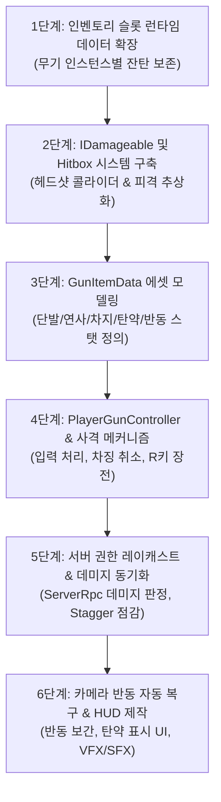

# 총기 사격 및 히트스캔 전투 시스템 명세서 (Gun Combat & Hitscan System Spec)

본 문서는 프로젝트의 **총기 발사, 히트스캔 데미지 판정, 탄약/재장전 시스템, 적 경직 메커니즘, 서버 권한 동기화** 전반의 기능 명세와 예외 케이스 처리 규칙을 정리한 기술/기획 통합 명세서입니다.

---

## 1. 시스템 개요

- **네트워크 아키텍처:** **Server-Authoritative (완전 서버 권한 판정)**
  - 레이캐스트 충돌 판정, 데미지 적용, 탄약 확정, 적 경직 계산은 모두 **서버**에서 실행합니다.
  - 조작 반응성(0ms 체감)을 위해 **사격음, 총구 화염, 화면 반동, 클라이언트 탄약 차감 예측**은 로컬 클라이언트에서 즉각 선반영(Client Prediction)됩니다.
- **주요 구성 요소:**
  - `GunItemData`: 무기 스탯(데미지, 사격 주기, 탄창, 반동, 발사 모드 등)을 정의하는 ScriptableObject.
  - `PlayerGunController` / `GunAction`: 사격 입력, 차징, 연사, 재장전, 반동 제어.
  - `InventorySlot` 런타임 데이터 확장: 무기 인스턴스별 잔탄 보존.
  - `IDamageable`: 몬스터 및 파괴 가능 오브젝트 피격 인터페이스.
  - `Hitbox` / `HeadHitbox`: 부위별(헤드샷 1.5배) 피격 판정 컴포넌트.
  - `AmmoHUD`: 현재 탄창 잔탄 및 인벤토리 예비 탄약 표시 UI.

---

## 2. 기능 상세 명세

### 1) 발사 모드 (Fire Modes)
총기 데이터에 따라 3가지 발사 모드를 지원합니다.
1. **단발 (Semi-Auto):**
   - 마우스 좌클릭 1회당 1발 발사.
   - 마우스를 누르고 있어도 연속 발사되지 않으며, 손을 뗐다가 다시 클릭해야 재발사.
   - 정해진 사격 주기(Fire Rate Cooldown) 동안은 재클릭해도 발사 불가.
2. **연사 (Full-Auto):**
   - 마우스 좌클릭을 누르고 있는 동안 사격 주기 간격으로 연속 발사.
   - 탄창이 0발이 되거나 클릭을 해제하면 발사 중단.
3. **차지 발사 (Charge Shot):**
   - 좌클릭을 홀드하여 차징 게이지를 모으고, **버튼을 떼는 순간(Release) 발사**.
   - **완전 충전(Full Charge):** 최소 차징 시간(예: 1.0초) 이상 충전 후 해제 시 강화탄 발사 (기본 2.0배 데미지, 데이터 조정 가능).
   - **부분 충전/미달(Partial/Under Charge):** 최소 차징 시간 전에 해제 시 일반 약한 탄환 발사 (기본 1.0배 데미지).
   - **소모 탄약:** 완전 충전과 미달 발사 모두 동일하게 **1발** 소모.
   - **차징 취소:** 차징 도중 **마우스 우클릭**을 누르면 차징이 즉시 취소되며 탄약 소모 없음.

---

### 2) 탄약 및 재장전 (Ammo & Reload)
1. **인벤토리 탄약 연동:**
   - 탄약은 인벤토리 슬롯에 보관되는 별도 아이템(예: `ItemData: Ammo_Pistol`, `Ammo_Rifle`)입니다.
   - 총기 데이터(`GunItemData`)에 해당 총기가 사용하는 `RequiredAmmoItemId`를 지정합니다.
2. **재장전 메커니즘 (R키 수동 장전):**
   - `R` 키 입력 시 재장전 프로세스 시작 (데이터로 지정된 `ReloadDuration` 초 소요).
   - 필요한 탄약 수 = `탄창 크기(MagazineSize) - 현재 잔탄(CurrentAmmo)`.
   - 인벤토리에서 해당 탄약 아이템을 검색하여 필요한 만큼 소모:
     - 인벤토리 탄약이 충분할 때: 탄창 완전 완충.
     - 인벤토리 탄약이 부족할 때: **인벤토리에 있는 수량만큼만 전부 소모하여 부분 장전** (예: 20발 필요하나 8발만 보유 시 8발만 추가 장전).
     - 인벤토리에 탄약이 0개일 때: 재장전 불가 (효과음/경고 피드백).
3. **무기 교체 시 잔탄 보존:**
   - 툴바 슬롯을 변경하거나 다른 아이템을 들었다가 다시 해당 총을 들어도 **남아있던 잔탄 수가 그대로 유지**됩니다.
   - 인벤토리 슬롯 데이터 구조에 무기 개별 상태(`RuntimeData: CurrentAmmo`)를 저장 및 동기화합니다.

---

### 3) 히트스캔 및 데미지 판정 (Hitscan & Damage)
1. **서버 완전 권한 레이캐스트:**
   - 클라이언트가 발사를 트리거하면 발사 원점과 카메라 시선 방향 벡터를 서버 RPC로 전송.
   - 서버는 **서버 월드의 현재 몬스터/오브젝트 위치**를 기준으로 `Physics.Raycast`를 1회 실행.
2. **명중 대상 및 팀킬 방지:**
   - **피격 가능 대상:**
     - 몬스터/적 (`NonPlayerCharacter`)
     - 파괴 가능한 오브젝트 (`IDamageable`을 가진 소품, 상자, 문 등)
   - **팀킬 방지 (Friendly Fire OFF):**
     - 충돌 대상이 플레이어(`PlayerController`)인 경우 데미지 판정을 무시하고 통과(또는 피격 이펙트만 출력).
3. **관통 없음 (No Penetration):**
   - 레이캐스트가 처음 부딪힌 단일 표면/콜라이더에서 즉시 종료.
4. **거리 감쇄 없음 (No Falloff):**
   - 최대 유효 사거리(예: 100m) 내에서는 거리에 상관없이 100% 데미지 적용.
5. **헤드샷 (1.5배 데미지):**
   - 대상 캐릭터의 머리 본/위치에 분리된 `HeadHitbox` 콜라이더가 피격되면 **기본 데미지의 1.5배** 적용.
   - 일반 몸통/콜라이더 피격 시 기본 데미지 적용.

---

### 4) 적 경직 시스템 (Stagger & Diminishing Returns)
1. **기본 경직:**
   - 데미지를 입은 적은 짧은 시간(`BaseStaggerDuration`, 기본 약 0.35초) 동안 이동 및 공격 행동이 일시 정지(Stun).
2. **무한 경직 방지 (점감 법칙 - Diminishing Returns):**
   - 연사 총기 등으로 단시간 내에 연속 타격당할 경우:
     - 피격 횟수가 누적될 때마다 경직 지속 시간이 점진적으로 감소 (예: 100% -> 60% -> 30% -> 0%).
     - 일정 시간(예: 2.0초) 동안 추가 피격이 없으면 경직 내성 타이머가 리셋되어 다시 100% 경직 적용.
   - 이를 통해 몬스터가 아무 반격도 못 하고 일방적으로 사망하는 현상(Stun-lock)을 방지.

---

### 5) 화면 반동 및 에임 복구 (Recoil & Recovery)
1. **탄착군 일치:**
   - 탄 퍼짐(Spread)은 0%이며, 총알은 **항상 크로스헤어 정중앙**으로 날아갑니다.
2. **화면 튕김 및 부드러운 자동 복구 (A안):**
   - 격발 시 카메라 피치(상하)가 순간적으로 위로 튕김 (`RecoilKickPitch`).
   - 약간의 미세 좌우 랜덤 흔들림 (`RecoilKickYaw`).
   - 발사 후 마우스 조작이 멈추면 **원래 조준점 높이로 부드럽게 복구(Smooth Recovery)**.

---

### 6) 연출 및 피드백 (VFX, SFX, HUD)
1. **비주얼 & 사운드:**
   - **발사자(1인칭):** 즉각적인 격발음, 총구 화염(Muzzle Flash), 탄피 배출, 탄 궤적(Tracer Line), 화면 반동.
   - **피격 지점 (환경/오브젝트/캐릭터 불문):** 데미지 유무와 관계없이 타격 지점 표면 노멀 각도에 맞춰 **먼지/파편/스파크 파티클** 스폰.
   - **네트워크 타인 화면:** 3인칭 총구 위치에서 총구 화염 및 격발음(3D Spatial Audio) 재생, 피격 지점 파티클 동기화.
2. **HUD 표시:**
   - 화면 우측 하단에 탄약 UI 렌더링:
     - `[ 현재 탄창 잔탄 / 인벤토리 소지 탄약수 ]` (예: `30 / 120`)
     - 재장전 중일 경우 `[ RELOADING... ]` 상태 표시.

### 7) 달리기(Sprint) ↔ 사격/장전 상호작용 규칙 (CoD 스타일)
1. **상호 캔슬 규칙:**
   - **사격/차징 중 달리기(`Shift` 입력):** 사격 즉시 중단 및 차징 취소(탄약 소모 0) 후 전력 질주 시작.
   - **재장전 중 달리기(`Shift` 입력):** 재장전 즉시 취소(탄약 충전 안 됨) 후 전력 질주 시작.
   - **달리기 중 사격/차징 시도(마우스 좌클릭):** 달리기 즉시 해제(걷기 속도로 감속) 및 총기 조준.
   - **달리기 중 재장전 시도(`R` 키):** 달리기 즉시 해제 및 재장전 시작.
2. **키 동시 입력 및 복귀 (Hold Contention):**
   - **상황 A (사격 중 달리기):** 사격 중 `Shift`로 달리기로 전환된 경우, 좌클릭을 누르고 있더라도 달리기가 끝났을 때 자동 발사되지 않으며 **마우스를 뗐다가 다시 클릭해야 사격 재개**.
   - **상황 B (달리다 사격 후 복귀):** 달리다가 좌클릭으로 사격한 뒤 마우스를 뗐을 때, **`Shift`를 여전히 누르고 있다면 자동으로 다시 달리기 재개**.
3. **달리기 후 사격 선딜레이 (Sprint to Fire Delay):**
   - 전력 질주 상태에서 사격 시 총을 바로 세우는 짧은 딜레이(`_sprintToFireDelay`, 기본 약 0.18초) 후 첫 발 격발.
4. **사격 중 이동 속도 페널티 (Shooting Move Penalty):**
   - 사격 중(격발 직후 일정 시간)에는 걷기 속도가 약 **25% 감소 (기본 속도의 75%로 이동)**하여 반동 제어감 부여 (`_shootingMovementMultiplier = 0.75f`).
   - 재장전 중에는 일반 걷기 속도(100%) 유지.

---

## 3. 데이터 구조 설계 (ScriptableObject)

```csharp
[CreateAssetMenu(fileName = "NewGunData", menuName = "Inventory/Gun Data")]
public class GunItemData : ItemData
{
    [Header("Gun Base Stats")]
    [SerializeField] private int _damage = 25;
    [SerializeField] private float _fireRate = 0.15f;          // 발사 간격(초)
    [SerializeField] private float _maxRange = 100f;
    [SerializeField] private GunFireMode _fireMode = GunFireMode.FullAuto;

    [Header("Charge Shot Settings (차지 모드 전용)")]
    [SerializeField] private float _minChargeDuration = 1.0f;  // 완전 충전에 필요한 시간
    [SerializeField] private float _chargedDamageMultiplier = 2.0f; // 완전 충전 시 배율

    [Header("Ammo & Reload")]
    [SerializeField] private int _magazineCapacity = 30;       // 탄창 용량
    [SerializeField] private float _reloadDuration = 2.0f;     // 재장전 시간
    [SerializeField] private string _requiredAmmoItemId = "Ammo_Rifle"; // 필요한 탄약 아이템 ID

    [Header("Recoil")]
    [SerializeField] private float _recoilPitch = 1.8f;        // 상단 반동 각도
    [SerializeField] private float _recoilYaw = 0.4f;          // 좌우 랜덤 반동
    [SerializeField] private float _recoilRecoverySpeed = 8.0f; // 에임 복구 속도

    [Header("Audio & Visuals")]
    [SerializeField] private AudioClip _fireSound;
    [SerializeField] private AudioClip _reloadSound;
    [SerializeField] private AudioClip _dryFireSound;          // 잔탄 0발 격발 시도음
    [SerializeField] private GameObject _muzzleFlashPrefab;
    [SerializeField] private GameObject _impactEffectPrefab;   // 먼지/파편 이펙트
    [SerializeField] private GameObject _bulletTracerPrefab;   // 탄 궤적
}

public enum GunFireMode
{
    SemiAuto = 0,   // 단발
    FullAuto = 1,   // 연사
    Charge = 2      // 차지샷
}
```

---

## 4. 예외 케이스 및 엣지 케이스 처리 규칙 (Edge Cases)

| 번호 | 상황 (Scenario) | 처리 및 동작 규칙 (Expected Behavior) |
| :---: | :--- | :--- |
| **E-01** | **잔탄 0발 상태에서 발사 시도** | - 발사되지 않으며 딸깍거리는 빈 총 격발음(`Dry Fire`) 1회 재생.<br>- 자동 재장전은 실행되지 않음 (수동 R키 필요). |
| **E-02** | **재장전 도중 무기 교체 (스왑)** | - 재장전 즉시 취소.<br>- 탄약 충전은 적용되지 않으며, 이전 잔탄 그대로 유지.<br>- 다시 해당 무기를 들면 재장전을 처음부터 다시 해야 함. |
| **E-03** | **재장전 도중 추가 발사 클릭** | - 발사 입력 무시.<br>- 재장전 타이머는 끊기지 않고 그대로 계속 진행. |
| **E-04** | **재장전 도중 인벤토리 탄약이 외부 요인으로 버려짐/소모됨** | - 장전 완료 시점(Progress 100%)에 인벤토리 탄약을 최종 확인하여 잔여 수량만큼만 충전. |
| **E-05** | **차징 도중 마우스 우클릭 입력** | - 차징 즉시 취소.<br>- 탄약 소모 0, 발사 연출 없음. |
| **E-06** | **차징 도중 무기 교체 / 피격 / 드롭(G키)** | - 차징 즉시 중단 및 리셋.<br>- 발사 및 탄약 소모 없음. |
| **E-07** | **인벤토리에 탄약이 0개일 때 R키 입력** | - 재장전 시작되지 않음.<br>- "탄약 부족" 효과음 또는 UI 알림 텍스트 점멸. |
| **E-08** | **벽에 완전히 밀착한 상태(총구가 벽 속으로 파고듦) 사격** | - 레이캐스트 원점을 카메라 뷰포트 위치(`MainCamera.transform.position`)에서 시작하여 벽을 뚫고 지나가는 판정 버그 원천 방지.<br>- 카메라 바로 앞 벽에 즉각 충돌하여 먼지 이펙트 발생. |
| **E-09** | **아군 플레이어를 조준하고 사격 (Friendly Fire)** | - 데미지 및 경직 적용 없음.<br>- 총알은 관통되지 않으므로 아군 플레이어 피격 지점에서 먼지/스파크 이펙트 발생 후 소멸. |
| **E-10** | **인벤토리에서 총기를 바닥에 버렸다가 다시 주웠을 때** | - 버리기 직전의 탄창 잔탄 수가 그대로 유지되어 인벤토리에 보관됨. |
| **E-11** | **네트워크 핑으로 인해 클라이언트가 본 위치와 서버 위치가 다를 때** | - 서버 권한 판정 기준에 따라 서버에서 레이캐스트가 빗나가면 데미지는 들어가지 않음.<br>- 단, 클라이언트 화면의 총소리/반동은 정상 출력되며, 서버 결과에 따라 적 피격 파티클만 누락됨. |
| **E-12** | **사격 / 차징 도중 Shift (달리기) 입력** | - 사격 및 차징 즉시 캔슬 (탄약 소모 0) 후 전력 질주로 전환.<br>- 좌클릭을 계속 누르고 있어도 달리기가 멈췄을 때 자동 발사되지 않으며, 마우스를 뗐다가 다시 클릭해야 사격 가능 (상황 A). |
| **E-13** | **달리는 도중 마우스 좌클릭 (사격/차징) 입력** | - 달리기 즉시 해제 (걷기 상태로 감속).<br>- `_sprintToFireDelay`(약 0.18초) 선딜레이 후 첫 발 격발.<br>- 사격을 멈추고 좌클릭을 뗐을 때 여전히 Shift 키를 누르고 있다면 자동으로 즉시 달리기 재개 (상황 B). |
| **E-14** | **재장전 도중 Shift (달리기) 입력** | - 재장전 즉시 취소 (탄약 충전 안 됨) 후 달리기 시작. |
| **E-15** | **달리는 도중 R키 (재장전) 입력** | - 달리기 즉시 해제 및 재장전 프로세스 시작. |

---

## 5. 단계별 구현 로드맵


