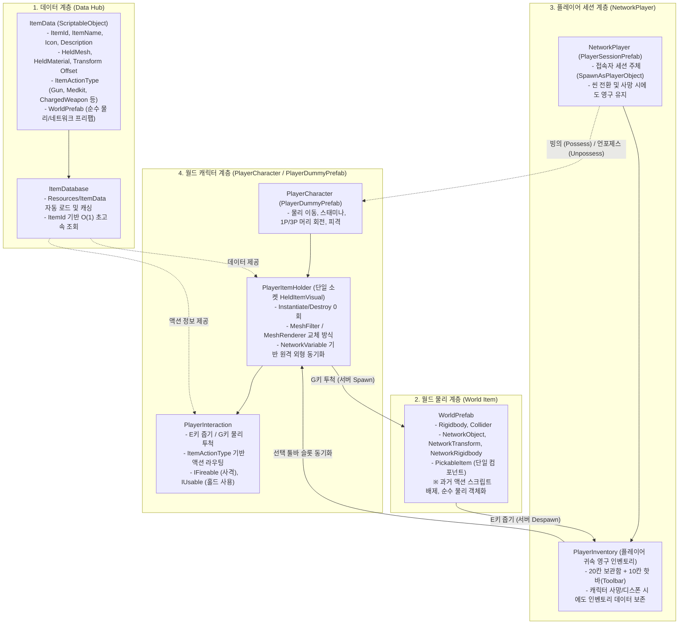

# 인벤토리 및 아이템 시스템 (Inventory & Item System)

본 문서는 프로젝트의 **인벤토리, 아이템 데이터, 월드 물리 드롭, 손 뷰모델(Held ViewModel), 네트워크 동기화** 전반의 아키텍처 및 구현 기능을 정리한 기술 문서입니다.

---

## 1. 아키텍처 개요 및 설계 원칙

### 핵심 설계 원칙
1. **플레이어 세션 귀속 인벤토리 (Session-Persistent Inventory):**
   - `PlayerInventory`는 월드 캐릭터가 아닌 **`NetworkPlayer` 세션 객체**에 귀속됩니다. 캐릭터가 사망하거나 디스폰되어도 소지품 데이터는 그대로 유지됩니다.
   - 캐릭터가 월드에 존재하지 않는 상태(관전/리스폰 대기)에서는 `Tab` 키를 통한 인벤토리 열람 및 숫자키(1~0) 툴바 조작이 자동으로 차단됩니다.
2. **단일 소켓 메쉬 교체 아키텍처 (Single-Socket Held Visual):**
   - 아이템마다 손 전용 프리팹(`Held_*.prefab`)을 생성/인스턴스화/파괴하지 않습니다.
   - 플레이어 손(`HoldPoint`)에 상시 부착된 단일 `HeldItemVisual`의 `MeshFilter.sharedMesh`와 `MeshRenderer.sharedMaterial`만 교체하여 **런타임 GC Alloc 0회 및 로드 딜레이 0초**를 달성했습니다.
3. **순수 `PickableItem` 월드 객체 (Pure World Object):**
   - 월드에 배치되거나 투척되는 오브젝트는 `SampleGunItem` 등의 기능 스크립트를 포함하지 않고, 순수한 물리/네트워크 컴포넌트와 [`PickableItem`](file:///c:/unity-projects/coop/Assets/Scripts/PickableItem.cs)만 가집니다.
4. **대규모 물리 멀티플레이어 최적화:**
   - 수십~수백 개의 아이템이 드롭되어도 성능 저하가 없도록 물리 수면(Sleep & Freeze), 레이어 충돌 격리, 거리 기반 LOD/컬링, GPU Instancing을 기본 내장했습니다.
5. **NGO 기반 완전 동기화:**
   - 호스트와 클라이언트 간에 물리 궤적(NetworkRigidbody), 손에 든 아이템 외형(NetworkVariable), 슬롯 조작이 오차 없이 일치합니다.

---

## 2. 주요 구성 요소 및 기능

### 1) 데이터 계층 (Data Hub)
- **[`ItemData.cs`](file:///c:/unity-projects/coop/Assets/Scripts/Inventory/ItemData.cs)**:
  - 아이템의 기본 정보(이름, 아이콘, 설명, 최대 스택 수)를 정의하는 ScriptableObject.
  - 손에 들었을 때 사용할 뷰모델 정보(`HeldMesh`, `HeldMaterial`, `HeldLocalPosition/Rotation/Scale`) 내장.
  - 아이템 액션 분류(`ItemActionType`: `None`, `Gun`, `Medkit`, `ChargedWeapon`, `Placeable`) 및 월드 프리팹(`WorldPrefab`) 참조 연결.
- **[`ItemDatabase.cs`](file:///c:/unity-projects/coop/Assets/Scripts/Inventory/ItemDatabase.cs)**:
  - `Assets/Resources/ItemData/` 경로의 모든 에셋을 자동 탐색하여 딕셔너리에 캐싱.
  - `GetItem(string itemId)`: $O(1)$ 초고속 아이템 조회.
  - `FindItemByObject(GameObject obj)`: 씬에 배치된 오브젝트나 이름 변형(예: `SamplePickableBox_1`)에서도 원본 `ItemData`를 안정적으로 찾아내는 양방향 매칭 지원.

---

### 2) 플레이어 인벤토리 & 홀더 계층
- **[`PlayerInventory.cs`](file:///c:/unity-projects/coop/Assets/Scripts/Inventory/PlayerInventory.cs)**:
  - 인벤토리 슬롯 배열 관리 (기본 30칸 인벤토리 + 9칸 핫바 슬롯).
  - 아이템 추가 시 기존 슬롯에 스택 병합 후 남은 수량을 새 빈 슬롯에 자동 배치.
  - 슬롯 간 스왑, 아이템 나누기, 빈 핫바 슬롯 자동 탐색(`FindEmptyToolbarSlot`).
  - `ToolbarSelectedIndex`: 현재 선택된 핫바 슬롯 인덱스(0~8) 관리 및 변경 이벤트 발행.
- **[`PlayerItemHolder.cs`](file:///c:/unity-projects/coop/Assets/Scripts/Inventory/PlayerItemHolder.cs)**:
  - 플레이어의 손 소켓(`HoldPoint`) 하위에 `HeldItemVisual` 단일 자식 오브젝트 관리.
  - **로컬 뷰모델 갱신:**
    - 핫바 슬롯 변경 시 메쉬와 머티리얼을 즉시 변경하고 오프셋 적용. 빈손일 땐 `SetActive(false)`.
    - 1인칭 화면에서는 그림자 끄기(`ShadowCastingMode.Off`).
  - **원격 플레이어 동기화:**
    - `NetworkVariable<FixedString64Bytes> _networkHeldItemId`를 통해 서버에 현재 든 아이템 ID 동기화.
    - 원격 클라이언트는 해당 플레이어의 손 소켓 메쉬/머티리얼을 교체하고 그림자 켜기(`ShadowCastingMode.On`).
  - **드롭 및 픽업 처리:**
    - 월드 아이템 획득 시 서버에 Despawn 요청 후 손에 든 상태(`_pendingHeldItemData`)로 유지.
    - 유저가 키보드 번호키(1~0) 입력 시 지정 툴바 슬롯(또는 다음 빈 슬롯)에 보관하며, 툴바 슬롯이 가득 찼다면 바닥으로 자동 드롭.
    - G키 투척 시 서버 RPC(`RequestDropItemServerRpc`)를 호출하여 월드 프리팹 스폰 및 물리 투척.
- **[`PlayerInteraction.cs`](file:///c:/unity-projects/coop/Assets/Scripts/PlayerInteraction.cs)**:
  - **E키 상호작용 (Pickup):** 시선 레이캐스트로 감지된 `PickableItem`을 손에 획득(미할당 상태).
  - **G키 드롭 (Drop):** 현재 들고 있는 아이템을 시선 방향 벡터(`lookDir * 6.0f + up * 1.5f`)로 투척.
  - **액션 라우팅:** 손에 든 아이템의 `ItemActionType`에 따라 내부 액션 핸들러 바인딩.
    - `Gun` $\to$ `IFireable` (좌클릭 시 즉시 탄환 발사 시뮬레이션 및 쿨다운)
    - `Medkit` $\to$ `IUsable` (좌클릭 유지 시 홀드 프로그레스 누적 후 사용 완료)
    - `ChargedWeapon` $\to$ `IFireable` + `IUsable` (단발 탭 사격 및 홀드 차지 사격 동시 지원)
    - `Placeable` $\to$ 건축 모드 진입 및 그리드 배치
  - 화면 중앙 조준점(Crosshair) 및 액션 힌트 UI 실시간 표시 (미할당 손 아이템 시 `[1~0] 툴바 슬롯에 넣기 | [G] 내려놓기` 안내).

---

### 3) 월드 물리 및 대규모 최적화 계층
- **[`PickableItem.cs`](file:///c:/unity-projects/coop/Assets/Scripts/PickableItem.cs)**:
  - 월드에 배치된 드롭 아이템의 기본 컴포넌트.
  - **Sleep & Freeze 패턴:** 투척 후 바닥에 닿아 속도가 임계값 이하로 0.15초 이상 유지되면 `_rigidbody.isKinematic = true`로 전환. 바닥에 멈춘 아이템의 PhysX CPU 연산 비용을 0으로 절감.
- **[`PhysicsLayerSetup.cs`](file:///c:/unity-projects/coop/Assets/Scripts/PhysicsLayerSetup.cs)**:
  - 전용 레이어 분리: Layer 6 (`PickableItem`), Layer 7 (`Player`).
  - `Physics.IgnoreLayerCollision(PickableItem, PickableItem, true)`: 아이템끼리 겹쳐도 튕겨 나가거나 비비는 $O(N^2)$ 물리 연산 차단.
  - `Physics.IgnoreLayerCollision(PickableItem, Player, true)`: 플레이어가 아이템을 밟고 튀어오르거나 걸리는 현상 방지.
- **[`ItemCullingManager.cs`](file:///c:/unity-projects/coop/Assets/Scripts/ItemCullingManager.cs)**:
  - 로컬 카메라와의 거리를 0.3초 주기로 감시:
    - 15m 초과: 그림자 캐스팅 비활성화.
    - 50m 초과: 렌더러 완전 비활성화.
- **GPU Instancing:**
  - 아이템 머티리얼에 GPU Instancing을 일괄 적용하여 동일 메쉬 아이템 수십 개가 있어도 단 1회의 드로우 콜로 렌더링.

---

### 4) UI 계층
- **[`InventoryUIController.cs`](file:///c:/unity-projects/coop/Assets/Scripts/Inventory/UI/InventoryUIController.cs)**:
  - 인벤토리 창 열기/닫기 (Tab키). 창이 열리면 마우스 커서 활성화 및 시점 회전 잠금.
  - 슬롯 드래그 앤 드롭, 아이템 이동, 스왑, HUD 툴바 클릭 지원.
- **[`InventorySlotUI.cs`](file:///c:/unity-projects/coop/Assets/Scripts/Inventory/UI/InventorySlotUI.cs)**:
  - 개별 슬롯 UI 아이콘 및 수량 텍스트, 선택 하이라이트 표시.

---

## 3. 네트워크 동기화 메커니즘 (NGO)

| 동작 | 호출 흐름 | 동기화 방식 |
| :--- | :--- | :--- |
| **아이템 줍기 (Pickup)** | `PlayerInteraction.Interact()` $\to$ `PlayerItemHolder.PickupWorldItem()` | 서버에서 월드 오브젝트 `NetworkObject.Despawn()` 후 손에 든 상태로 유지 |
| **손에 들기 (Hold Visual)** | 핫바 변경 또는 아이템 줍기 $\to$ `PlayerItemHolder.UpdateHeldItem()` | 로컬 메쉬 즉시 교체 + `_networkHeldItemId.Value` 서버 RPC 변경 $\to$ 원격 클라이언트 `OnValueChanged`로 메쉬 교체 |
| **번호키 툴바 배치** | 숫자키(1~0) 입력 $\to$ `SelectToolbarSlot()` $\to$ `TryPutHeldWorldItemToToolbar()` | 빈 슬롯 탐색 후 툴바 슬롯 삽입 (가득 찼을 경우 바닥에 드롭) |
| **아이템 투척 (Drop)** | `PlayerInteraction.DropHeldItem()` $\to$ `RequestDropItemServerRpc()` | 손 비우기 $\to$ 서버에서 `WorldPrefab` 스폰 $\to$ `NetworkRigidbody`로 포물선 궤적 전원 동기화 |

---

## 4. 새로운 아이템 추가 가이드

코드 작성 없이 에디터 작업만으로 새 아이템을 추가할 수 있습니다:

### Step 1. `ItemData` 에셋 생성
1. Project 창에서 [`Assets/Resources/ItemData/`](file:///c:/unity-projects/coop/Assets/Resources/ItemData/) 폴더로 이동.
2. 우클릭 $\to$ `Create > Inventory > Item Data`.
3. 설정:
   - `Item Id`: 고유 영문 식별자 (예: `IronSword`)
   - `Item Name` / `Icon` / `Description`: UI 표시용 정보
   - `Held Mesh` / `Held Material`: 손에 들었을 때 표시할 3D 메쉬와 머티리얼
   - `Held Local Position / Rotation / Scale`: 손 소켓 기준 위치/회전/크기 조정값
   - `Action Type`: `None`, `Gun`, `Medkit`, `ChargedWeapon`, `Placeable` 중 선택

### Step 2. 월드 프리팹(`WorldPrefab`) 생성
1. 월드에 떨어질 오브젝트를 프리팹으로 구성 (예: `Assets/Prefabs/IronSword.prefab`).
2. 필수 컴포넌트 추가:
   - `Collider`, `Rigidbody`
   - `NetworkObject`, `NetworkTransform`, `NetworkRigidbody`
   - [`PickableItem`](file:///c:/unity-projects/coop/Assets/Scripts/PickableItem.cs) $\to$ `ItemData` 슬롯에 Step 1에서 만든 에셋 연결.
3. Step 1의 `ItemData` $\to$ `World Prefab` 슬롯에 이 프리팹 연결.

### Step 3. 완료
- 게임 실행 시 [`ItemDatabase`](file:///c:/unity-projects/coop/Assets/Scripts/Inventory/ItemDatabase.cs)가 에셋을 자동 로드하므로 추가 설정 없이 즉시 사용 가능합니다.
