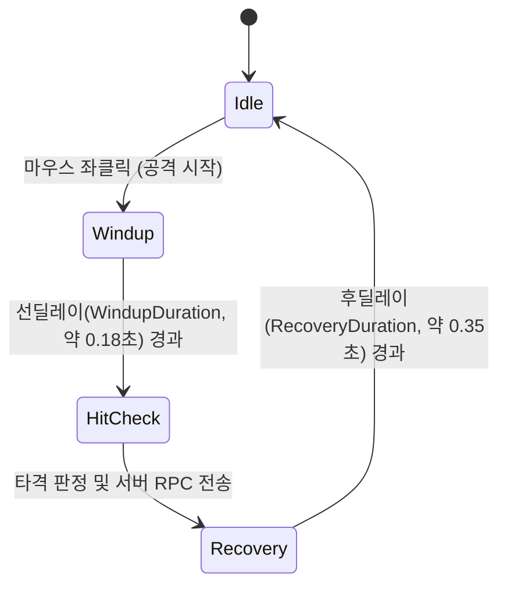

# 근접 무기 전투 시스템 명세서 (Melee Combat System Spec)

본 문서는 프로젝트의 **근접 무기 장착, 공격 입력(Auto-Swing), 선딜레이 및 구체 캐스트 판정, 서버 권한 데미지/헤드샷, 넉백 및 경직, 벽 충돌 차단, 예외 상태 제어** 전반의 기능 명세와 예외 케이스 처리 규칙을 정리한 기술/기획 통합 명세서입니다.

---

## 1. 시스템 개요

- **네트워크 아키텍처:** **Server-Authoritative (완전 서버 권한 판정)**
  - 공격 유효 거리 검증, 충돌 판정, 데미지 적용, 넉백 및 적 경직 계산은 모두 **서버**에서 실행합니다.
  - 조작 반응성(0ms 체감)을 위해 **스윙 SFX, 화면 흔들림, 뷰모델 휘두르기 애니메이션**은 로컬 클라이언트에서 즉각 선반영(Client Prediction)됩니다.
- **주요 구성 요소:**
  - `MeleeItemData`: 근접 무기 스탯(데미지, 사거리, 반경, 쿨다운, 선딜레이, 후딜레이, 넉백 등)을 정의하는 ScriptableObject.
  - `PlayerMeleeCombat`: 근접 공격 입력, 타이밍 제어, 이동 감속, 서버 RPC 요청, 프로시저럴 뷰모델 애니메이션.
  - `DamageInfo`: 피격 데미지, 타격 부위(HitboxType), 넉백 세기/방향 정보를 담는 구조체.
  - `NonPlayerCharacter` / `MonsterController`: 데미지, 경직(Stagger) 및 서버 넉백 물리 처리.
  - `IDamageable`: 몬스터 및 파괴 가능 오브젝트 피격 인터페이스.

---

## 2. 기능 상세 명세

### 1) 발동 및 조작 방식 (Input & Trigger)
1. **근접 무기 전용 발동 (Exclusive to Melee Items):**
   - 오직 핫바에서 `ItemActionType.MeleeWeapon` 아이템을 선택하여 손에 들고 있을 때만 마우스 좌클릭(`LMB`)으로 공격을 시작합니다.
   - 빈손(Empty Hand) 또는 총기(`Gun`), 도구 장착 상태에서는 근접 공격이 발동하지 않습니다.
2. **자동 연속 휘두르기 (Auto-Swing):**
   - 마우스 좌클릭을 누르고 있는 동안 공격 주기(`AttackInterval`) 간격으로 공격이 자동으로 연속 발동됩니다.
   - 단발 클릭 시에도 1회 정상 발동됩니다.

---

### 2) 공격 타이밍 및 딜레이 구조 (Timing & Flow)
하나의 근접 공격은 다음 3단계로 진행됩니다.


1. **선딜레이 (Wind-up):**
   - 공격 시작 즉시 스윙 효과음 재생 및 뷰모델 휘두르기 모션 시작.
   - 달리기(Sprint) 즉시 해제 및 이동 속도 50% 감속 적용.
   - 이 기간 동안에는 아직 타격 판정이 발생하지 않음.
2. **타격 판정 (Hit Check):**
   - 선딜레이가 끝나는 순간 카메라 시선 기준으로 정면 탐색(SphereCast / Raycast)을 실행.
3. **후딜레이 (Recovery):**
   - 공격 후 무기를 원래 자세로 되돌리는 시간.
   - 전체 공격 시간 = `WindupDuration + RecoveryDuration` $\le$ `AttackInterval`.

---

### 3) 판정 방식 및 충돌 검사 (Hit Detection & Collision)
1. **단일 대상 타격 (Single Target):**
   - 카메라 뷰포트 정중앙(0.5, 0.5)에서 전방으로 `Physics.SphereCast(origin, radius, direction, maxRange)` 실행.
   - 부채꼴 광역 타격이 아닌, 크로스헤어 정면에 위치한 가장 가까운 단일 대상 1체만 명중합니다.
2. **벽 및 장애물 차단 검사 (Wall Occlusion Check):**
   - 공격 경로 상에 벽이나 장애물(World Collider)이 가로막고 있는 경우:
     - 벽 너머에 적이 있더라도 공격이 벽에 가로막혀 적에게 닿지 않습니다.
     - 벽 타격 시 무기 튕김 캔슬은 없으나, 벽 충돌 스파크/먼지 VFX 및 벽 타격 SFX를 재생합니다.
3. **명중 대상 및 팀킬 방지 (Friendly Fire OFF):**
   - **피격 가능 대상:** 적(`NonPlayerCharacter`), 파괴 가능 오브젝트(`IDamageable`).
   - **아군 보호:** 피격 대상이 아군 플레이어(`PlayerController`)인 경우 판정을 무시합니다.
4. **헤드샷 보너스 (1.5배):**
   - 대상의 `HeadHitbox`에 명중한 경우 기본 공격력의 **1.5배** 데미지를 적용합니다.

---

### 4) 피격 효과 및 리액션 (Stagger & Knockback)
1. **넉백 (Knockback):**
   - 적 명중 시 공격자의 시선 방향(`lookDirection`) 수평 벡터로 적을 밀쳐냅니다.
   - 서버의 `MonsterController`에서 `NavMeshAgent` 일시 제어 및 물리 이동 처리를 통해 안정적으로 밀려납니다.
2. **경직 (Stagger):**
   - 총기 시스템과 동일하게 적에게 경직(`BaseStaggerDuration`, 약 0.35초)을 부여하여 행동을 일시 중단시킵니다.
   - 연속 타격 시 점감 법칙(Diminishing Returns)이 그대로 적용됩니다.

---

### 5) 이동 속도 감속 및 상태 제어
1. **공격 중 이동 감속:**
   - 선딜레이부터 후딜레이가 끝날 때까지 이동 속도가 기본 걷기의 50%로 감속됩니다 (`ShootingMovementMultiplier = 0.5f`).
   - 전력 질주(Sprint)는 즉시 취소되며, 공격 중에는 달리기가 재발동되지 않습니다.
2. **슈퍼아머 (Super Armor):**
   - 공격 동작 중에 적에게 피격당하거나 데미지를 입어도 내 근접 공격 모션 및 판정은 캔슬되지 않고 끝까지 실행됩니다.
3. **입력 잠금 (Action Lock):**
   - 공격 모션(선딜 + 후딜)이 진행 중일 때는 다음 입력이 잠깁니다:
     - 핫바 슬롯 번호키(1~9번) 및 마우스 휠 슬롯 변경 금지.
     - 손에 든 아이템 버리기(G키 투척) 금지.

---

## 3. 예외 케이스 처리 매트릭스 (Edge Cases)

| 번호 | 상황 (Situation) | 처리 규칙 (Resolution) |
| :---: | :--- | :--- |
| **E-01** | 빈손(맨손) 상태에서 좌클릭 | 아무 동작도 하지 않음 (공격 불가). |
| **E-02** | 총기 또는 도구를 든 상태에서 근접 공격 시도 | 근접 공격 미발동 (총기는 사격, 도구는 고유 액션만 수행). |
| **E-03** | 공격 선딜레이 도중 적에게 피격됨 | 슈퍼아머 유지. 공격 모션 및 타격 판정이 정상적으로 끝까지 진행됨. |
| **E-04** | 공격 진행 도중 번호키(1~9)로 무기 교체 시도 | 교체 입력 무시. 공격 모션이 완전히 종료된 후에만 슬롯 변경 가능. |
| **E-05** | 공격 진행 도중 G키(아이템 버리기) 입력 시도 | 드롭 입력 무시. 무기를 휘두르는 도중에는 버릴 수 없음. |
| **E-06** | 얇은 벽 바로 뒤에 적이 있는 상태에서 휘두름 | 벽 레이캐스트에 먼저 충돌하므로 벽 뒤의 적은 데미지를 입지 않음. 벽 타격 이펙트/SFX만 발생. |
| **E-07** | 좌클릭을 꾹 누르고 있는 상태 (홀드) | 쿨다운마다 자동으로 다음 1타 공격이 연속으로 발동됨 (Auto-Swing). |
| **E-08** | 점프/공중 상태에서 공격 | 공중에서도 정상 발동. 공중 속도 제어 유지. |
| **E-09** | 아군 플레이어를 정면에서 타격 | Friendly Fire OFF로 데미지 및 넉백 없음. |
| **E-10** | 공격 도중 사망 또는 넉다운 | 즉시 공격 중단 및 판정 취소. |

---

## 4. 데이터 스펙 (MeleeItemData Spec)

```csharp
[CreateAssetMenu(fileName = "NewMeleeItemData", menuName = "Inventory/Melee Item Data")]
public class MeleeItemData : ItemData
{
    // 공격력 및 판정
    int BaseDamage = 35;
    float AttackInterval = 0.6f;      // 전체 공격 주기 (초)
    float WindupDuration = 0.18f;     // 타격 전 선딜레이 (초)
    float RecoveryDuration = 0.35f;   // 타격 후 후딜레이 (초)
    float AttackRange = 2.2f;         // 사거리 (미터)
    float AttackRadius = 0.35f;       // SphereCast 판정 반경

    // 피격 효과
    float KnockbackForce = 5.5f;      // 넉백 밀쳐내기 강도
    float MovementMultiplier = 0.5f;  // 공격 중 이동 속도 배율

    // 오디오 및 연출
    AudioClip SwingSound;
    AudioClip HitFleshSound;
    AudioClip HitObjectSound;
    AudioClip HitWallSound;
    GameObject HitFleshVfx;
    GameObject HitWallVfx;
}
```
