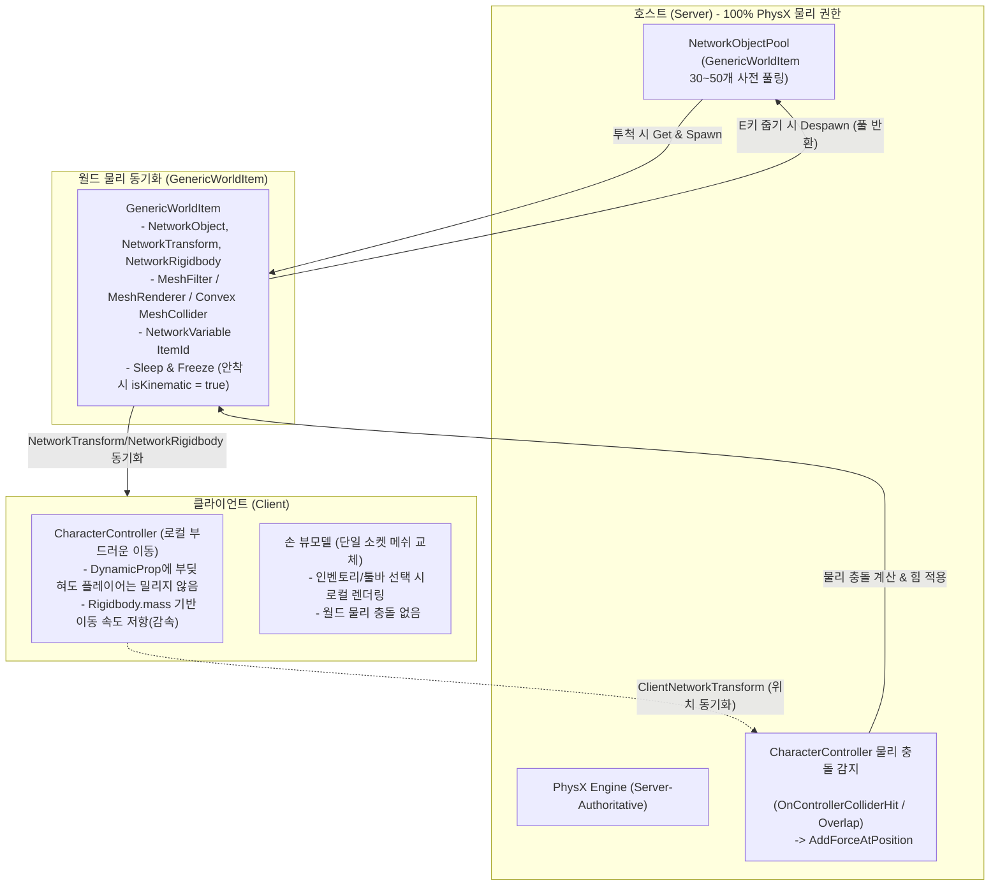

# 물리 협동 게임 아키텍처 명세서 (Physics Co-op Architecture)

본 문서는 Netcode for GameObjects (NGO) 기반의 멀티플레이 환경에서 **호스트 전담 물리 연산, CharacterController 단방향 반작용, 단일 범용 프리팹 풀링, 질량 기반 밀기 및 외력 동기화** 시스템의 아키텍처와 구현 상세를 정의합니다.

---

## 1. 아키텍처 개요 및 설계 원칙



### 핵심 설계 원칙
1. **서버 전담 물리 권한 (Server-Authoritative Physics):**
   - 씬 내의 모든 동적 물리 객체(`DynamicProp`, `GenericWorldItem`)의 PhysX 연산 권한은 100% 호스트(Server)에 고정합니다.
   - 클라이언트는 `NetworkRigidbody`를 통해 `isKinematic = true` 상태로 서버의 물리 시뮬레이션 결과(궤적)만을 수신합니다.
2. **`CharacterController` 기반 단방향 물리 반작용:**
   - 플레이어는 Kinematic 특성을 가진 `CharacterController`로 이동합니다.
   - 공중에서 날아오는 물리 객체가 플레이어에게 부딪히면, 플레이어는 전혀 밀려나지 않고 물리 객체만 표면 법선 벡터에 따라 자연스럽게 튕겨 떨어집니다.
   - 바닥에 놓인 물리 객체와 충돌할 때는 `OnControllerColliderHit`을 통해 물리 객체에 힘을 전달하고, 객체의 `Rigidbody.mass`에 비례하여 플레이어의 이동 속도에 자연스러운 저항(감속)을 부여합니다.
3. **단일 범용 프리팹 풀링 (Single Prefab Multi-Item Pooling):**
   - 아이템마다 별도의 물리 프리팹을 생성하지 않고, 단 하나의 `GenericWorldItem` 프리팹을 `NetworkObjectPool`에 사전 인스턴스화하여 사용합니다.
   - `ItemId` 동기화 변수를 통해 `MeshFilter`, `MeshRenderer`, `Convex MeshCollider`의 `sharedMesh`를 동적으로 교체합니다.
   - 런타임 `Instantiate` / `Destroy`를 배제하여 GC 스파이크와 패킷 폭증을 원천 차단합니다.
4. **수면 및 고정 (Sleep & Freeze 최적화):**
   - 물리 객체가 투척된 후 바닥에 닿아 정지하면 자동으로 `isKinematic = true`로 전환되어 PhysX CPU 연산과 네트워크 대역폭(0 Byte/s)을 절감합니다.
   - 플레이어가 접촉하거나 사격/근접 타격을 받으면 즉시 `isKinematic = false`로 깨어납니다 (Wake Up).

---

## 2. 플레이어 물리 및 밀기 메커니즘 (`PlayerCharacter.cs`)

### 1) CharacterController 이동
- `CharacterController.Move()`를 사용하여 수평 걷기/달리기, 점프, 중력 가속도를 제어합니다.
- 복잡한 자식 Hitbox 계층 없이 `CharacterController` 단일 컴포넌트만으로 완벽한 무한대 질량 벽체 역할을 수행합니다.

### 2) 질량 기반 충돌 밀기 및 이동 감속 (`OnControllerColliderHit`)
- 플레이어가 이동 중 물리 객체(`Rigidbody`)와 충돌할 때 실행됩니다:
  - **수직 충돌(발로 밟음):** `hit.moveDirection.y < -0.3f`인 경우 물리 객체 위로 올라타지 않도록 아래로 누르는 힘을 가하거나 스텝 글리치를 방지합니다.
  - **수평 충돌(몸으로 밈):**
    - **힘 전달:** 충돌 지점과 이동 방향에 비례하여 `hit.rigidbody.AddForceAtPosition(pushDir * pushForce, hit.point, ForceMode.Impulse)`을 가합니다. (호스트 서버에서 직접 연산).
    - **속도 저항:** `hit.rigidbody.mass`와 `_maxPushableMass` 비율을 계산하여 플레이어의 이동 속도를 실시간 감속합니다.
      $$\text{Resistance} = \operatorname{Clamp01}\left(\frac{\text{Mass}}{\text{MaxPushableMass}}\right)$$
      $$\text{SpeedMultiplier} = 1.0 - (\text{Resistance} \times 0.7)$$
      (예: 150kg 한계 질량 기준, 15kg 캔은 감속 0%, 75kg 상자는 속도 35% 감속, 150kg 이상은 최대 70% 감속 또는 통과 불가 벽체로 작용)

---

## 3. 단일 범용 프리팹 풀링 (`GenericWorldItem.cs` & `NetworkObjectPool.cs`)

### 1) `GenericWorldItem` 구성
- **필수 컴포넌트:**
  - `NetworkObject`: 네트워크 스폰/디스폰 제어
  - `NetworkTransform`: 위치/회전 보간 동기화 (15~20Hz, 압축 전송)
  - `NetworkRigidbody`: 클라이언트 Kinematic 자동 동기화
  - `Rigidbody`: 질량, 마찰, 중력 시뮬레이션
  - `MeshFilter`, `MeshRenderer`: 외형 렌더링
  - `MeshCollider (convex = true)`: 외형에 일치하는 정밀 물리 충돌
  - `GenericWorldItem`: 아이템 데이터 바인딩 및 안착 최적화

### 2) 외형 및 콜라이더 동적 교체
- `NetworkVariable<FixedString64Bytes> _networkItemId` 선언.
- 아이템 스폰 시 서버에서 `_networkItemId.Value = itemData.ItemId` 설정.
- `OnValueChanged` 이벤트 트리거:
  ```csharp
  ItemData data = ItemDatabase.GetItem(newItemId.ToString());
  if (data != null && data.HeldMesh != null)
  {
      _meshFilter.sharedMesh = data.HeldMesh;
      _meshRenderer.sharedMaterial = data.HeldMaterial;
      _meshCollider.sharedMesh = data.HeldMesh;
      transform.localScale = data.HeldLocalScale;
  }
  ```

### 3) `NetworkObjectPool` 생명주기
1. **Scene Load / Init:** `GenericWorldItem` 프리팹을 30~50개 사전 생성(Pre-warm)하여 비활성화 대기.
2. **Q키 투척 (Drop):**
   - 서버가 풀에서 사용 가능한 `NetworkObject` 획득.
   - `transform.SetPositionAndRotation(dropPos, dropRot)`.
   - `NetworkObject.Spawn(true)`.
   - `_networkItemId.Value` 할당 및 `Rigidbody.linearVelocity = throwVelocity`.
3. **E키 줍기 (Pickup):**
   - 플레이어가 상호작용 성공 시 서버가 `NetworkObject.Despawn(false)` 호출.
   - 풀에 반환되어 비활성화 상태로 보관.

---

## 4. 외력 및 타격 동기화 (Hit / Impulse)

- 플레이어의 총기 사격([`PlayerGunCombat.cs`](file:///c:/unity-projects/coop/Assets/Scripts/Combat/PlayerGunCombat.cs)) 또는 근접 공격([`PlayerMeleeCombat.cs`](file:///c:/unity-projects/coop/Assets/Scripts/Combat/PlayerMeleeCombat.cs))이 물리 객체에 적중하면:
  - 서버 측 히트 판정 시 대상 `Rigidbody`에 즉시 `AddForceAtPosition(bulletDir * impactForce, hitPoint, ForceMode.Impulse)` 실행.
  - 잠자고 있던(`isKinematic = true`) 물리 객체는 충격을 받는 즉시 `isKinematic = false`로 깨어나며 튕겨나감.
